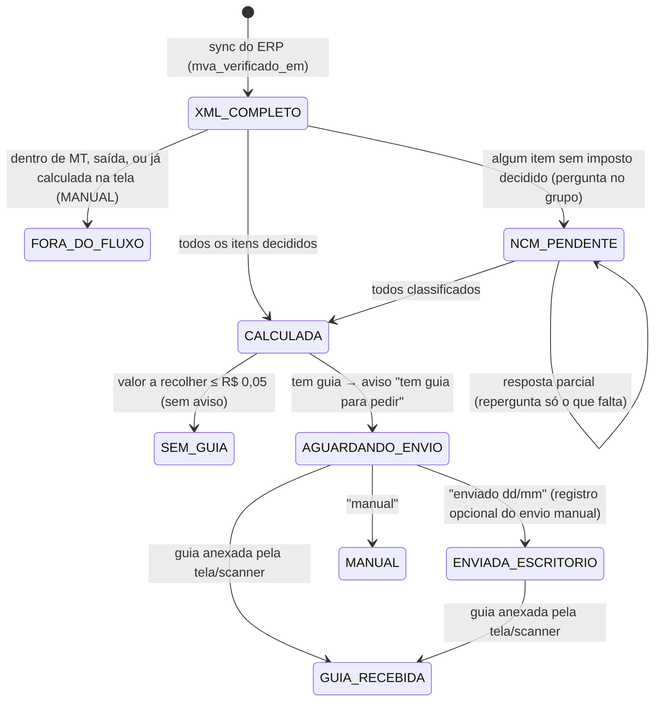

# Automação do ICMS-ST/DIFAL de entrada: cálculo → aviso no WhatsApp → guia anexada

Estado em 14/09/2026: **Fases 1, 2 e 3 implementadas.** Objetivo: a NF de compra
cair, o serviço calcular o ICMS-ST/DIFAL sozinho e avisar no grupo de guias do WhatsApp que há
guia a pedir ao escritório. O pedido ao escritório e o anexo da guia continuam **manuais**; o
fluxo percebe sozinho quando a guia foi anexada. Quando algum item não tem imposto decidido, a
classificação é pedida no WhatsApp e o cálculo só roda depois que todos foram respondidos.

**Decisões fechadas:**

- DIFAL (item de uso e consumo) entra no mesmo fluxo; a guia pode ser ICMS-ST, DIFAL ou as duas.
- O SUBTIPO do cadastro do produto vale mais que a tabela de NCM. **NCM na tabela sozinho não
  decide**: sem o cadastro dizer revenda, uma pessoa escolhe entre ST, DIFAL e tributada.
- Qualquer membro do grupo do WhatsApp pode responder.
- O fluxo das guias usa um **grupo de WhatsApp próprio** (`WAHA_GUIAS_CHAT_ID`), separado do grupo
  "Conferência Fiscal" da auditoria (`WAHA_GROUP_CHAT_ID`). O "ajustado" continua no grupo antigo.
- **Sem integração com o Teams.** As contas da AC e do escritório são pessoais (Teams gratuito),
  que não tem API. O pedido ao escritório é feito à mão no grupo do Teams; o serviço só avisa.

## 1. Como funciona hoje (o que o fluxo reaproveita)

| Passo | Onde está | Observação |
|---|---|---|
| NF chega do ERP | `icms-sync.cron` (1 min) → `syncInvoices()` lê `NFE_DISTRIBUICAO` e grava `com_nfe_conciliacao` com o XML | Quando o XML **completo** chega, `maybeAlertMva()` preenche `mva_verificado_em` — é o sinal que o fluxo usa. |
| Usuário clica **Calcular** | `POST /icms/calculate` → `calculateStForInvoice(xml)` | Por item: `findMvaInRef(NCM)` na tabela embutida (`constants/mva-data.ts`), match exato → raiz 6 → raiz 4. Não achou → MVA padrão 50,39% e `matchType = 'Não Encontrado'`. Calcula ST por item, compara com o destacado, tolerância `GUIA_TOLERANCIA_BRL` (R$ 10). DIFAL pelo regime do fornecedor (ReceitaWS + CRT). |
| Usuário marca revenda / uso-consumo / tributada e salva | tela `StCalculationResults.tsx` → `POST /icms/payment-status` → `savePaymentStatus()` | Grava `com_pagamento_guia` (valor, `observacoes` = "Tem Guia Complementar" / "Sem Guia - Verificado"), `tipo_imposto`, itens em `com_nfe_conciliacao_item` e roda a conferência fiscal. |
| Guia em PDF | `POST /icms/guia/:chave/upload` → MinIO + `com_nfe_guia_pdf`; ou scanner → `esc_documento` (`tipo = 'guia-icms-st'`, `chave_nfe`) | Aparece no card "Guia da NF". |
| WhatsApp | `wahaEnviarTexto()` (envio) e `wahaLerMensagens()` (polling; a nuvem não alcança a intranet) | Idempotência por id da mensagem em `com_nfe_ajustado_processado`. |

## 2. Fluxo



### 2.1 Chegada da NF (Fase 1)

`st-fluxo.cron.ts` (1 min, só com `ST_FLUXO_ENABLED=true`) → `StFluxoService.processarCiclo()`.
Poller na `com_nfe_conciliacao`: NF de **fora de MT** (chave
não começa com 51; dentro de MT o ST já vem retido pelo fornecedor), emitida nos últimos
`ST_FLUXO_JANELA_DIAS` (7), com `mva_verificado_em` preenchido e **sem** linha em
`com_nfe_st_fluxo`. NF que já tem `com_pagamento_guia` (alguém calculou na tela) entra como
`MANUAL`, sem aviso.

Decisão do imposto por item, nesta ordem (para na primeira regra que responde):

1. CFOP fora de `CFOP_INTERESTADUAIS_TRIBUTADOS` → **TRIBUTADA** (sem tributação, regra atual).
2. Produto vinculado no cadastro (`PRODUTOS_FORNECEDOR_NFE` → `PRODUTOS.SUBTIPO`) com `07`
   (uso/consumo) → **DIFAL**.
3. SUBTIPO `00` (revenda) **e** NCM na tabela de MVA (`findMvaInRef`) → **ST**.
4. Resposta do WhatsApp para este item → **o que a pessoa disse** (st / difal / tributada).
5. Senão → **pendente**, com o motivo: "sem vínculo no cadastro", "revenda, NCM fora da tabela
   de ST" ou os dois.

Com todos decididos, roda `calculateStForInvoice(xml)` e grava pelo **mesmo**
`savePaymentStatus()` da tela (`usuario: 'Automático'`). A NF aparece em `/fiscal/nfe` como se
alguém tivesse calculado, mais o badge do estado do fluxo (campo `fluxo` do
`GET /icms/payment-status`).

Valor da guia = ST líquida dos itens ST + `vlDifal` dos itens DIFAL, a mesma conta da tela;
"tem guia" só acima de `GUIA_TOLERANCIA_BRL` (R$ 10): até isso a NF fica "Sem Guia - Verificado". A regra
mora em `savePaymentStatus()`, então vale também para quem calcula pela tela. `valorPagoAMais` entra na mensagem como
**excedente**, sem guia. Item ST com NCM fora da tabela usa o **MVA padrão 50,39%** e a mensagem
diz quantos foram.

### 2.2 Mensagens no WhatsApp (grupo das guias)

Todas terminam com a chave de 44 dígitos em `` `código` `` — é assim que o roteador reconhece
a NF na resposta citada. Aviso que falhou (WAHA fora) é reenviado no ciclo seguinte
(`waha_msg_aviso` nulo).

**A) Tem guia** (estado `AGUARDANDO_ENVIO`):

Regra dos textos (pedido da equipe em 14/09): primeiro o que importa e o que fazer, depois os
detalhes; pouco jargão. Os textos vivem em `montarAviso()` / `montarLembrete()` e as respostas
curtas em `rotear()`; `POST /icms/st-fluxo/exemplo` manda todos com dados fictícios.

```
🧾 *Existe guia a recolher* — NF *12345* · NOME DO FORNECEDOR (SP)
*ICMS complementar: R$ 1.234,56*          ← "DIFAL" ou "ICMS complementar (ST + DIFAL)" conforme o caso

📨 *O que fazer:* pedir a guia ao escritório.
Depois de pedir, responda a esta mensagem com *enviado 25/09* (data do vencimento).
Se preferir tratar pela tela, responda *manual*.

Detalhes da apuração:                      ← só aparece quando há algo
• Em alguns itens o fornecedor destacou ST a mais: R$ 80,10 (não gera guia)
• 2 item(ns) calculado(s) com o MVA padrão, por não estar(em) na tabela
`51260912345678000199550010000123451000123456`
```

**B) Preciso de uma resposta** (estado `NCM_PENDENTE`):

```
❓ *Preciso de uma resposta* — NF *12345* · NOME DO FORNECEDOR (SP)
Não consegui definir o imposto de 2 item(ns). Me diga o que é cada um:
• item 3 — PARAFUSO SEXTAVADO M8 (cód. ABC123)
• item 7 — ÓLEO LUBRIFICANTE 1L (cód. XYZ9)

Responda a esta mensagem, um item por linha:
*3 st* = revenda com ICMS-ST · *3 difal* = uso e consumo · *3 tributada* = sem ST
ou *todos st* para todos iguais.
Assim que responder, eu calculo e aviso se tem guia.
`5126...`
```

**F) Lembrete** (a cada `ST_FLUXO_LEMBRETE_DIAS`, citando o aviso original):

```
⏳ *Guia pendente há 3 dias* — NF *12345* · R$ 1.234,56
A guia foi pedida ao escritório e o PDF ainda não foi anexado. Quando chegar, anexe pela tela ou pelo scanner.
```
(ou, sem registro de envio: "Ainda não há registro do pedido ao escritório. Peça a guia e responda *enviado dd/mm* na mensagem da NF.")

**Sem guia**: não avisa (fica na tela como "Sem Guia - Verificado"). **Guia anexada**: não
avisa; a tela mostra "Guia recebida".

### 2.3 Respostas aceitas (Fase 2)

`StFluxoService.processarRespostasWaha()` (cron `auditoria-ajustado.cron.ts`, 1 min) lê o grupo
da auditoria (só "ajustado") e o grupo das guias (os demais comandos); se as duas envs apontam
para o mesmo grupo, lê uma vez com todos. Mensagem sem comando conhecido é ignorada sem tocar
no banco. Parsers puros em `st-fluxo.parse.ts`; checagem: `node scripts/check-st-fluxo-parse.mjs`.

| Estado da NF | Resposta (citando a mensagem da NF) | Efeito |
|---|---|---|
| qualquer | `ajustado` | reconferência da auditoria fiscal (`IcmsService.tratarRespostaAjustado`, inalterado) |
| `AGUARDANDO_ENVIO` | `enviado 25/09` (ou `pode enviar 25/09`) | grava vencimento e quem respondeu → `ENVIADA_ESCRITORIO` → "✅ registrada como enviada" |
| `AGUARDANDO_ENVIO` | `enviado` sem data | "❓ qual o vencimento?" |
| `AGUARDANDO_ENVIO` | `manual` | `MANUAL`, sai do fluxo |
| `NCM_PENDENTE` | linhas `3 st`, `7 difal`, `9 tributada`, `todos st` (sinônimos: revenda = st, consumo/uso = difal) | grava a classificação e chama `calcular()`; repergunta só o que falta ou manda a msg A |
| outro | qualquer dos acima | "ℹ️ NF está em <estado>; nada a fazer" |

### 2.4 Guia anexada (fecha o fluxo)

`detectarGuiasAnexadas()` a cada ciclo: NF em `AGUARDANDO_ENVIO` ou `ENVIADA_ESCRITORIO` com
linha em `com_nfe_guia_pdf` (upload pela tela) ou `esc_documento` com `tipo = 'guia-icms-st'` e a
mesma `chave_nfe` (scanner) → `GUIA_RECEBIDA`, sem aviso.

## 3. Dados (DDL manual: `sql/2026-09-14_st_fluxo.sql`)

`com_nfe_st_fluxo`: uma linha por NF — `estado`, `tipo_guia`, `valor_guia`, `valor_excedente`,
`itens_padrao`, `itens_pendentes` (jsonb), `classificacao` (jsonb), `vencimento`,
`autorizado_por`/`autorizado_em` (quem registrou o envio), `waha_msg_aviso`, `guia_recebida_em`,
`lembrete_em`, `erro`. Idempotência das respostas reusa `com_nfe_ajustado_processado` (resultados
novos: ENVIADA, MANUAL, CLASSIFICADA, CLASSIFICACAO_INVALIDA, ESTADO_INVALIDO, SEM_VENCIMENTO,
FORA_DO_FLUXO). Não há modelo Prisma: tudo por `$queryRawUnsafe`, não precisa de `prisma generate`.

## 4. Fases

| Fase | Entrega | Arquivos | Estado |
|---|---|---|---|
| 1 | Cálculo automático + avisos A/B + badge na lista de NF-e | `src/icms/st-fluxo.service.ts`, `st-fluxo.cron.ts`, `sql/2026-09-14_st_fluxo.sql`, `getPaymentStatusMap()` (campo `fluxo`), `cotacao-frontend app/(private)/fiscal/nfe/page.tsx` | ✅ codada |
| 2 | Roteador de respostas (enviado / manual / classificação) + detecção da guia anexada | `st-fluxo.parse.ts`, `st-fluxo.service.ts`, `auditoria-ajustado.cron.ts` (chama o roteador), `icms.service.ts` (`wahaLerMensagens`, `tratarRespostaAjustado`, `wahaEnviarTexto` com `chatId`), `scripts/check-st-fluxo-parse.mjs` | ✅ codada |
| 3 | Lembrete de guia parada (`lembrar()`, a cada `ST_FLUXO_LEMBRETE_DIAS`, citando o aviso original) + endpoints: `GET /icms/st-fluxo[?estado=]`, `POST /icms/st-fluxo/exemplo` (manda as mensagens A, B e F com dados fictícios no grupo, mesmo em dry-run), `POST /icms/st-fluxo/:chave/manual`, `POST /icms/st-fluxo/:chave/reprocessar` | `st-fluxo.service.ts`, `icms.controller.ts` | ✅ codada (sem botões na tela: só o badge) |

## 5. Variáveis de ambiente

**Sem comentário na mesma linha do valor.** O painel do EasyPanel guarda `CHAVE=valor  # texto`
literalmente; o código limpa isso (`envLimpo`), mas o resto do serviço não. Copie só `CHAVE=valor`.

```
ST_FLUXO_ENABLED=true            # liga o fluxo (opt-in: fala com pessoas)
ST_FLUXO_DRY_RUN=1               # 1 = monta as mensagens e só loga (primeiro teste)
ST_FLUXO_JANELA_DIAS=7           # só NFs emitidas nos últimos N dias (evita spam no 1º deploy)
ST_FLUXO_CRON=* * * * *
ST_FLUXO_LEMBRETE_DIAS=3         # lembrete de guia a pedir/pedida sem PDF há N dias (repete a cada N)
WAHA_GUIAS_CHAT_ID=              # grupo das guias (120363...@g.us); sem ele cai no WAHA_GROUP_CHAT_ID
```

Já existentes e reusadas: `WAHA_BASE_URL`, `WAHA_API_KEY`, `WAHA_SESSION`, `WAHA_GROUP_CHAT_ID`,
`WAHA_AJUSTADO_*`, `GUIA_TOLERANCIA_BRL`.

## 6. Subir

1. Aplicar `sql/2026-09-14_st_fluxo.sql` no Postgres da intranet.
2. `ST_FLUXO_ENABLED=true`, `WAHA_GUIAS_CHAT_ID=<grupo>`, `ST_FLUXO_DRY_RUN=1`; deploy do
   fiscal-service e do cotacao-frontend.
3. Conferir no log as mensagens montadas (`DRY-RUN WhatsApp: ...`) e o número de quem respondeu
   (campo `participant` do WAHA; se vier vazio, trocar o campo em `lerGrupo`).
4. Ver o formato no grupo: `curl -X POST https://fiscal-service.acacessorios.local/api/icms/st-fluxo/exemplo`
   (manda 3 mensagens fictícias + um aviso de que são exemplos).
5. Tirar o `ST_FLUXO_DRY_RUN`.

## 7. Riscos e armadilhas

- **Leitura do WAHA depende do engine WEBJS saudável** ("envia mas não lê", HTTP 500 em
  `chats/*/messages`; a solução foi subir a imagem). O aviso (saída) não depende disso; as
  respostas sim.
- **ReceitaWS** tem teto ~3 req/min no plano gratuito; lote de NFs no mesmo minuto cai no
  fallback pelo CRT do XML (comportamento já previsto).
- **MVA padrão 50,39%** para NCM fora da tabela é estimativa; a mensagem diz quantos itens o usaram.
- **NCM repetido**: a mesma pergunta voltará para o mesmo produto em outra NF. Quando incomodar,
  gravar as classificações respondidas (fornecedor + código do produto → imposto) e consultar
  antes de perguntar (30 linhas).
- **Nunca marca "enviado" antes do fato**: aviso só grava o id com resposta ok do WAHA; falha
  volta no próximo ciclo.
