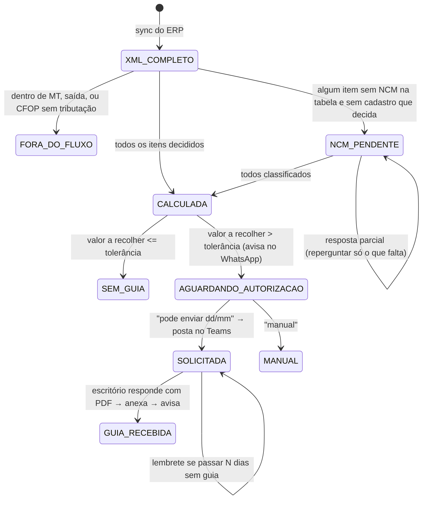

# Automação do ICMS-ST de entrada: cálculo → WhatsApp → Teams → guia anexada

Plano de implementação (set/2026). Objetivo: a NF de compra cair, o serviço calcular o
ICMS-ST sozinho, avisar no grupo "Conferência Fiscal" do WhatsApp, receber a autorização
(e o vencimento) por resposta na própria conversa, pedir a guia ao escritório contábil pelo
Teams, e, quando o escritório responder com o PDF, anexar a guia à nota na intranet e avisar
no WhatsApp. Quando algum NCM não está na tabela de MVA, a classificação é pedida no
WhatsApp e o cálculo só roda depois que todos os itens foram respondidos.

**Decisões fechadas em 14/09/2026:**

- DIFAL (item de uso e consumo) entra no mesmo fluxo; a guia pode ser ICMS-ST, DIFAL ou as duas.
- O SUBTIPO do cadastro do produto vale mais que a tabela de NCM. **NCM na tabela sozinho não
  decide**: sem o cadastro dizer revenda, uma pessoa escolhe entre ST, DIFAL e tributada.
- Qualquer membro do grupo do WhatsApp pode autorizar o envio ao escritório.
- No Teams a conversa com o escritório é um **chat em grupo** (não canal de equipe).

## 1. Como funciona hoje (o que o plano reaproveita)

| Passo | Onde está | Observação |
|---|---|---|
| NF chega do ERP | `icms-sync.cron` (1 min) → `syncInvoices()` lê `NFE_DISTRIBUICAO` e grava `com_nfe_conciliacao` com o XML | Quando o XML **completo** chega, já existe o gancho `maybeAlertMva()` (alerta de MVA > 50,39%). O cálculo automático entra **no mesmo ponto**. |
| Usuário clica **Calcular** | `POST /icms/calculate` → `calculateStForInvoice(xml)` | Por item: `findMvaInRef(NCM)` na tabela embutida (`constants/mva-data.ts`), match exato → raiz 6 → raiz 4. Não achou → MVA padrão 50,39% e `matchType = 'Não Encontrado'`. Calcula ST por item, compara com o destacado, tolerância `GUIA_TOLERANCIA_BRL` (R$ 10). DIFAL pelo regime do fornecedor (ReceitaWS + CRT). |
| Usuário marca revenda / uso-consumo / tributada e salva | tela `StCalculationResults.tsx` → `POST /icms/payment-status` → `savePaymentStatus()` | Grava `com_pagamento_guia` (valor, `observacoes` = "Tem Guia Complementar" / "Sem Guia - Verificado"), `tipo_imposto` ("ICMS ST", "DIFAL", "Tributada"), itens em `com_nfe_conciliacao_item` e roda a conferência fiscal. |
| Guia em PDF | `POST /icms/guia/:chave/upload` → `uploadGuiaByNfe()` → MinIO `documentos/notas/<chave>/` + `com_nfe_guia_pdf` | Aparece no card "Guia da NF". A guia escaneada pelo app vem por outro caminho (`esc_documento`). |
| WhatsApp de saída | `wahaEnviarTexto()` direto no WAHA (respostas) e n8n → WAHA (alertas) | Grupo `WAHA_GROUP_CHAT_ID`. |
| WhatsApp de entrada | `auditoria-ajustado.cron` (1 min) → `processarRespostasAjustadoWaha()` | **Polling** (a nuvem não alcança a intranet). Acha a chave de 44 dígitos na mensagem citada, idempotência em `com_nfe_ajustado_processado`. Só entende "ajustado". |
| Teams | — | **Não existe integração nenhuma.** |

Conclusão: o cálculo, a persistência, a guia e a leitura/escrita no WhatsApp já existem.
O que falta é (a) disparar sozinho, (b) um roteador de respostas por estado, (c) o Teams.

## 2. Fluxo proposto



### 2.1 Chegada da NF (automático) — **implementado (Fase 1)**

`st-fluxo.cron.ts` (1 min, só com `ST_FLUXO_ENABLED=true`) → `StFluxoService.processarCiclo()`.
Em vez de gancho dentro do `syncInvoices()`, é um **poller** na `com_nfe_conciliacao`: NF de
**entrada** (`tipo_operacao = 0`), de **fora de MT** (chave não começa com 51; dentro de MT o
ST já vem retido pelo fornecedor e não há guia), emitida nos últimos `ST_FLUXO_JANELA_DIAS`
(7), com `mva_verificado_em` preenchido (é o sinal de que o XML **completo** já foi lido pelo
`maybeAlertMva`) e **sem** linha em `com_nfe_st_fluxo`. NF que já tem `com_pagamento_guia`
(alguém calculou na tela) entra como `MANUAL`, sem aviso.

Decisão do imposto por item, nesta ordem (para na primeira regra que responde):

1. CFOP fora de `CFOP_INTERESTADUAIS_TRIBUTADOS` → **TRIBUTADA** (sem tributação, regra atual).
2. Produto vinculado no cadastro (`PRODUTOS_FORNECEDOR_NFE` → `PRODUTOS.SUBTIPO`) com `07`
   (uso/consumo) → **DIFAL**.
3. SUBTIPO `00` (revenda) **e** NCM na tabela de MVA (`findMvaInRef`) → **ST**.
4. Resposta do WhatsApp para este item → **o que a pessoa disse** (st / difal / tributada).
5. Senão → **pendente**, com o motivo: "sem vínculo no cadastro", "revenda, NCM fora da tabela
   de ST" ou os dois.

Com todos decididos, roda `calculateStForInvoice(xml)` e grava pelo **mesmo**
`savePaymentStatus()` que a tela usa (`usuario: 'Automático'`), com `itens[]` montados como a
tela monta. Assim a NF aparece na tela `/fiscal/nfe` exatamente como se alguém tivesse
calculado: "Tem Guia Complementar", `tipo_imposto`, itens da conferência.

Valor da guia = soma de `diferenca` dos itens ST (positiva) + `vlDifal` dos itens DIFAL, como
hoje. `valorPagoAMais` (ST destacada acima da calculada) entra na mensagem como **excedente**,
sem guia.

### 2.2 Mensagens no WhatsApp (grupo Conferência Fiscal)

Todas terminam com a chave de 44 dígitos em `` `código` `` — é assim que o roteador reconhece
a NF na resposta citada (padrão já usado pelo "ajustado").

**A) Tem guia** (estado `AGUARDANDO_AUTORIZACAO`):

```
🧾 *ICMS-ST calculado* — NF *12345*
Fornecedor: NOME DO FORNECEDOR (SP)
Itens: 14 · ST a recolher: *R$ 1.234,56*
(DIFAL uso/consumo: R$ 0,00)
Excedente: ST destacada acima da calculada em R$ 80,10 (sem guia)
2 itens usaram o MVA padrão 50,39% (NCM fora da tabela)

↩️ Responda a esta mensagem com *pode enviar 25/09* para pedir a guia ao escritório,
ou *manual* para tratar na tela.
`51260912345678000199550010000123451000123456`
```

**B) Imposto a definir** (estado `NCM_PENDENTE`):

```
❓ *Imposto a definir* — NF *12345* · NOME DO FORNECEDOR (SP)
Preciso saber o imposto de cada item para calcular:
• item 3 — ABC123 PARAFUSO SEXTAVADO M8 (NCM 7318.15.00) — sem vínculo no cadastro
• item 7 — XYZ9 ÓLEO LUBRIFICANTE 1L (NCM 2710.19.32) — revenda, NCM fora da tabela de ST

↩️ Responda citando esta mensagem, um item por linha:
3 st   ·   7 difal   ·   9 tributada   ·   ou: todos st
`5126...`
```

**C) Solicitada**: `📨 Guia da NF *12345* solicitada ao escritório (venc. 25/09).`
**D) Recebida**: `✅ Guia da NF *12345* recebida do escritório e anexada à nota na intranet.`
**E) Sem guia**: não avisa (fica registrado na tela como "Sem Guia - Verificado").
**F) Lembrete**: `⏳ Guia da NF *12345* pedida há 3 dias e ainda sem retorno do escritório.`

### 2.3 Respostas aceitas (roteador)

`processarRespostasAjustadoWaha()` vira `processarRespostasWaha()`: lê o grupo uma vez por
minuto (como hoje), para cada mensagem não tratada acha a chave na mensagem citada, busca o
estado em `com_nfe_st_fluxo` e roteia:

| Estado da NF | Resposta | Regex | Efeito |
|---|---|---|---|
| qualquer | `ajustado` | (existente) | reconferência da auditoria (inalterado) |
| `AGUARDANDO_AUTORIZACAO` | `pode enviar 25/09` ou `pode enviar 25/09/2026` | `/pode\s+enviar.*?(\d{1,2})\/(\d{1,2})(?:\/(\d{2,4}))?/i` | grava vencimento + quem autorizou → posta no Teams → `SOLICITADA` → msg C |
| `AGUARDANDO_AUTORIZACAO` | `pode enviar` sem data | | responde "qual o vencimento? ex.: pode enviar 25/09" |
| `AGUARDANDO_AUTORIZACAO` | `manual` | | `MANUAL`, some do fluxo |
| `NCM_PENDENTE` | linhas `3 st`, `7 difal`, `9 tributada`, `todos st` (sinônimos: revenda = st, consumo/uso = difal) | `/^\s*(\d+|todos)\s*[:\-–]?\s*(st|revenda|difal|consumo|uso|tributad\w*)/im` por linha | grava `classificacao` por item e chama `StFluxoService.calcular(chave, classificacao)` (já pronto); repergunta só o que falta |
| `NCM_PENDENTE` | `3 st ref 45` | idem + `ref (\d+)` | usa a linha 45 da tabela de MVA em vez do padrão 50,39% (ainda não previsto no cálculo) |
| outro | qualquer | | responde "esta NF está em <estado>; nada a fazer" |

Item classificado como revenda com NCM ausente da tabela usa o **MVA padrão 50,39%**, como a
tela faz hoje ("Guia Compl. (Padrão 50%)").

Quem pode autorizar: qualquer membro do grupo; o número fica em `autorizado_por` para rastreio.

### 2.4 Teams (escritório contábil)

Sem integração hoje. Caminho mais curto: **Microsoft Graph com permissões delegadas de uma
conta de serviço** (ex.: `fiscal@acacessorios.com.br`) que é membro do chat em grupo com o
escritório. Evita as permissões de aplicativo `Chat.Read.All`, que são "API protegida" e exigem
aprovação da Microsoft.

Pré-requisitos (fora do código, uma vez):

1. Registro de aplicativo no Entra ID (Azure AD) do tenant da AC: tipo "Web", redirect
   `https://fiscal-service.acacessorios.local/api/teams/auth/callback` (ou `http://localhost:3001/...`).
   Permissões delegadas: `Chat.ReadWrite`, `Files.ReadWrite`, `Files.Read.All`, `offline_access`, `User.Read`.
   Consentimento do administrador do M365.
2. Conta de serviço adicionada ao chat do escritório. Id do chat: `GET /me/chats` logado com
   ela (formato `19:...@thread.v2`).
3. Login único: abrir `GET /api/teams/auth` na intranet com a conta de serviço; o callback
   guarda o refresh token cifrado (reusar `nfse-crypto.util.ts`, AES-256-GCM) em
   `com_teams_credencial`. Daí em diante só refresh.

Cliente `src/shared/teams/teams-graph.client.ts` (fetch puro, sem SDK):

- `enviarSolicitacao(chave)`: sobe XML + DANFE (gerado pelo `POST danfe` existente) para
  `/me/drive/root:/GuiasST/<nf>/`, cria link de compartilhamento e posta a mensagem com os
  anexos referenciados. Guarda `teams_msg_id`.
- `lerRespostas()` (cron 2 min): `GET /chats/{id}/messages/delta` (guarda o `deltaLink`).
  Mensagem de outro remetente com anexo `.pdf` e (a) `messageReference` para uma
  `teams_msg_id` nossa, ou (b) texto com o nº da NF ou a chave → baixa via
  `GET /shares/u!<base64url(contentUrl)>/driveItem/content` → `uploadGuiaByNfe(chave, pdf)`
  → `GUIA_RECEBIDA` → WhatsApp msg D. Idempotência: `com_nfe_ajustado_processado` com id
  `teams:<messageId>`.
  PDF sem NF identificável → WhatsApp: "📎 O escritório mandou um PDF no Teams sem NF
  identificada; anexe pela tela." (nunca adivinhar).

Mensagem no Teams:

```
Solicitação de guia de ICMS-ST — NF 12345
Fornecedor: NOME DO FORNECEDOR — CNPJ 00.000.000/0001-00
Chave: 5126...
Valor a recolher: R$ 1.234,56 — Vencimento: 25/09/2026
Anexos: XML da NF-e e DANFE.
Por favor, responder a esta mensagem com a guia em PDF.
```

Se o tenant não liberar o Graph, o plano B é o mesmo fluxo por e-mail (email-service já
existe; leitura da resposta por IMAP), sem mudar nada do lado do WhatsApp.

## 3. Dados (DDL manual, `sql/0xx_st_fluxo.sql`)

```sql
CREATE TABLE IF NOT EXISTS com_nfe_st_fluxo (
  chave_nfe          varchar(44) PRIMARY KEY REFERENCES com_nfe_conciliacao(chave_nfe),
  estado             varchar(30) NOT NULL,          -- NCM_PENDENTE | SEM_GUIA | AGUARDANDO_AUTORIZACAO | SOLICITADA | GUIA_RECEBIDA | MANUAL | ERRO
  tipo_guia          varchar(20),                   -- ICMS_ST | DIFAL | ICMS_ST/DIFAL
  valor_guia         numeric(14,2),
  valor_excedente    numeric(14,2),
  itens_padrao       integer,                       -- itens ST calculados com o MVA padrão 50,39%
  itens_pendentes    jsonb,                         -- [{nItem, cProd, xProd, ncm, motivo}]
  classificacao      jsonb,                         -- {"3":"ST","7":"DIFAL","9":"TRIBUTADA"}
  vencimento         date,
  autorizado_por     varchar(30),                   -- número do WhatsApp
  autorizado_em      timestamptz,
  waha_msg_aviso     varchar(120),                  -- id da última mensagem nossa (aviso/pergunta)
  teams_msg_id       varchar(120),
  teams_guia_msg_id  varchar(120),
  guia_recebida_em   timestamptz,
  lembrete_em        timestamptz,
  erro               text,
  created_at         timestamptz NOT NULL DEFAULT now(),
  updated_at         timestamptz NOT NULL DEFAULT now()
);
CREATE INDEX IF NOT EXISTS ix_st_fluxo_estado ON com_nfe_st_fluxo (estado);

CREATE TABLE IF NOT EXISTS com_teams_credencial (
  id              smallint PRIMARY KEY DEFAULT 1,
  conta           varchar(200) NOT NULL,
  refresh_token   text NOT NULL,                    -- cifrado AES-256-GCM (TEAMS_SECRET)
  delta_link      text,                             -- último deltaLink das mensagens do chat
  updated_at      timestamptz NOT NULL DEFAULT now()
);
-- Idempotência de mensagens lidas (WhatsApp e Teams): reusa com_nfe_ajustado_processado;
-- mensagens do Teams entram com waha_msg_id = 'teams:<messageId>'.
```

Depois: `npx prisma db pull` + `npx prisma generate` (padrão DDL manual).

## 4. Fases

| Fase | Entrega | Arquivos | Depende de |
|---|---|---|---|
| **0** | Registro no Entra ID, conta de serviço no chat, id do chat, textos combinados com a equipe | — | admin do M365 |
| **1** ✅ | Cálculo automático + aviso A/B no WhatsApp; badge de estado na lista de NF-e | `src/icms/st-fluxo.service.ts`, `st-fluxo.cron.ts`, `sql/2026-09-14_st_fluxo.sql`, `getPaymentStatusMap()` (campo `fluxo`), `cotacao-frontend app/(private)/fiscal/nfe/page.tsx` | aplicar o SQL; `ST_FLUXO_ENABLED=true` |
| **2** | Roteador de respostas (pode enviar / manual / classificação) | `auditoria-ajustado.cron.ts` (renomear p/ `waha-respostas.cron.ts`), `st-fluxo.service.ts` | Fase 1 |
| **3** | Teams: solicitação com anexos + leitura da guia + anexo automático + msg D | `src/shared/teams/teams-graph.client.ts` (novo), `teams.controller.ts` (`GET /teams/auth`, `/callback`), cron 2 min, `st-fluxo.service.ts` | Fase 0 e 2 |
| **4** | Lembrete (msg F) e endpoints de intervenção: `GET /icms/st-fluxo`, `POST /icms/st-fluxo/:chave/manual`, `POST .../reenviar` | controller + tela | Fase 3 |

Cada fase é útil sozinha: com a Fase 1 no ar a equipe já para de clicar em Calcular; com a
2, autoriza pelo celular; com a 3, a guia chega sem ninguém baixar/anexar.

## 5. Variáveis de ambiente novas

```
ST_FLUXO_ENABLED=true            # liga o cálculo automático (opt-in: fala com pessoas)
ST_FLUXO_DRY_RUN=1               # 1 = monta a mensagem e só loga (primeiro teste)
ST_FLUXO_JANELA_DIAS=7           # só NFs emitidas nos últimos N dias (evita spam no 1º deploy)
ST_FLUXO_CRON=* * * * *
ST_FLUXO_LEMBRETE_DIAS=3
TEAMS_TENANT_ID=
TEAMS_CLIENT_ID=
TEAMS_CLIENT_SECRET=
TEAMS_REDIRECT_URI=
TEAMS_CHAT_ID=                   # 19:...@thread.v2
TEAMS_SECRET=                    # chave AES p/ cifrar o refresh token
TEAMS_CRON=*/2 * * * *
TEAMS_CRON_DISABLED=false
```

## 6. Riscos e armadilhas conhecidas

- **Leitura do WAHA depende do engine WEBJS saudável**: já aconteceu "envia mas não lê"
  (HTTP 500 em `chats/*/messages`); a solução foi subir a imagem. O fluxo de resposta herda
  esse risco; o de aviso (saída) não.
- **ReceitaWS** tem teto ~3 req/min no plano gratuito. Um lote de NFs no mesmo minuto cai no
  fallback pelo CRT do XML (comportamento já previsto). Aceitável.
- **MVA padrão 50,39%** para NCM fora da tabela é uma estimativa; a mensagem A diz quantos
  itens usaram o padrão, para a pessoa decidir se autoriza.
- **NCM repetido**: a mesma pergunta voltará para o mesmo NCM em outra NF. Quando incomodar,
  gravar as classificações respondidas em `com_ncm_classificacao` (NCM → revenda/consumo/ref)
  e consultá-la antes de perguntar (Fase 2b, 30 linhas).
- **Anexo no chat em grupo do Teams** fica no OneDrive de quem mandou; a conta de serviço lê
  porque é membro do chat. Só chat em grupo é suportado; canal de equipe usa outra rota do
  Graph e fica de fora até que seja necessário.
- **Nunca gravar antes do fato**: WhatsApp e Teams só marcam "enviado" com resposta 2xx;
  falha volta no próximo ciclo (mesma regra do alerta de MVA).
